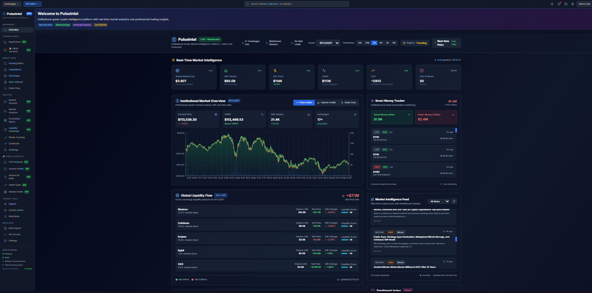

# PulseIntel - Real-Time Crypto Market Intelligence Platform
# Dashboard Preview



**PulseIntel** is a professional-grade, real-time cryptocurrency market intelligence platform designed for traders, analysts, and institutions. It provides comprehensive market data, advanced analytics, and actionable insights.

## ✨ Features

### 📊 **Real-Time Market Data**
- **Live Price Feeds**: WebSocket-powered real-time price updates with 2-decimal precision
- **Global Market Metrics**: Live global market cap and 24h volume from CoinGecko API
- **Multi-Exchange Data**: Aggregated data from major cryptocurrency exchanges
- **VWAP & CVD**: Real-time Volume Weighted Average Price and Cumulative Volume Delta

### 📱 **Mobile-Responsive Design**
- **Adaptive Layout**: Optimized for desktop, tablet, and mobile devices
- **Collapsible Navigation**: Mobile-friendly sidebar with organized sections
- **Touch-Optimized**: Proper touch targets and smooth animations
- **Real-Time Price Display**: Always-visible live price updates in header

### 🔍 **Advanced Analytics**
- **Market Microstructure**: Deep order book analysis and liquidity tracking
- **Smart Money Tracking**: Institutional flow detection and whale movements
- **Cross-Exchange Arbitrage**: Real-time arbitrage opportunities
- **Funding Rate Analysis**: Comprehensive funding rate monitoring across exchanges
- **Sentiment Analysis**: Market sentiment indicators and fear/greed index

### 📈 **Professional Tools**
- **Advanced Orderbook**: Multi-level order book visualization with heatmaps
- **Volatility Matrix**: Real-time volatility analysis across timeframes
- **Liquidation Analytics**: Liquidation cascade detection and analysis
- **News Integration**: Real-time crypto news feed with RSS aggregation

## 🏗️ Architecture

PulseIntel follows a modern microservices architecture:

```
┌──────────────────┐                 ┌─────────────────────┐
│    Go Stream     │─(gzip data)───▶ │   Python WebSocket  │
│ (BTC/ETH/SOL     │                 │   Service           │
│  Feed from       │                 │   (Normalization)   │
│  Binance/Bybit/  │                 │   Port: 8000        │
│  Okx, Port: 8899)│                 └─────────┬───────────┘
└──────────────────┘                           │
                                               │
                                               ▼
                                       ┌───────────────┐
                                       │   Frontend    │
                                       │   (React,     │
                                       │   Port: 5174) │
                                       └───────────────┘

┌─────────────────────┐
│  Python REST API    │
│  Service            │
│  (RSS, OI, Funding  │
│  Rate, etc.)        │
│  Port: 8080         │
└─────────┬───────────┘
          │
          ▼
   ┌───────────────┐
   │   Frontend    │
   └───────────────┘
```

#### **How Data Flows:**
- **Go Stream** ingests BTC, ETH, and SOL data from Binance, Bybit, and Okx, compresses with gzip, and sends to the **Python WebSocket Service** for normalization. The WebSocket then sends this data to the **React Frontend**.
- The **REST API** is an isolated Python service (not connected to the WebSocket) to avoid latency bottlenecks. It pulls anything REST (RSS news, OI, funding rate, etc.) and sends directly to the frontend.
- **WebSocket and REST API services do NOT communicate directly**. Both independently send data to the frontend.

#### **Why This Design?**
The REST API is kept completely independent from the WebSocket service to avoid latency bottlenecks. This ensures that REST data (such as news, funding rates, OI) is delivered to the frontend without being delayed by real-time streaming traffic handled by the WebSocket service.

## 🚀 Quick Start
...